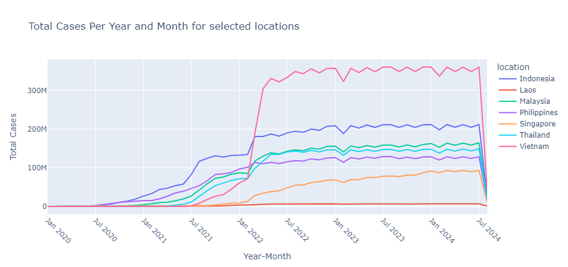

# Coronavirus COVID19-Deaths

## Setup module, path and dataset


```python
%load_ext autoreload
%autoreload 2
```


```python
# Import public module
import os
import sys
import time
import warnings

import pandas as pd

# setup paths
setPath = os.path.join(os.getenv(key='LinkPaths'), 'arrowSEnvs')
if setPath not in sys.path: sys.path.append(setPath)
from setupEnv import setupEnv
setupEnv.setPaths()
arrowDb = setupEnv.pathAt.get('path1')
COVID19DbasePath = setupEnv.pathAt.get('COVID19DbasePath')
localPathDataset = '__dataset___'

# Import Internal modul to manage the database, file database and path database
import arrowDb
from arrowDb.sets import SetPathFiles
```


```python
# download datasets
urlFile = ['url/owid-covid-codebook.csv.url',
            'url/owid-covid-data.csv.url',
            'url/owid-covid-data.json.url',
            'url/owid-covid-data.xlsx.url']
SetPathFiles.url_download_file(urlFile, localPathDataset)
```


<hr style="width: 60%; margin-left: 0; border: none; border-top: 1px solid black; margin-bottom: 0;">


    ...Starting download for owid-covid-codebook.csv...
    The file _dataset___\owid-covid-codebook.csv has been successfully downloaded.
    The file _dataset___\owid-covid-data.csv already exists. Download skipped.
    The file _dataset___\owid-covid-data.json already exists. Download skipped.
    The file _dataset___\owid-covid-data.xlsx already exists. Download skipped.
    


<hr style="width: 60%; margin-left: 0; border: none; border-bottom: 1px solid black; margin-top: 0;">


```python
# Setup the database connetion
SetPathFiles.list_files_path(localPathDataset)
COVID19db = arrowDb.JunctDbase(
                'sqlite',conn_typesub='sqlite3',
                file_dbase='owidcovid19.sqlite ',
                folder_path=COVID19DbasePath)
os.environ['COVID19dbstr'] = COVID19db.conn('conn string')

# load the magic sql
%load_ext sql
time.sleep(1)
%sql $COVID19dbstr

# Automatically limit the number of rows displayed
%config SqlMagic.displaylimit = 20
```


<hr style="width: 60%; margin-left: 0; border: none; border-top: 1px solid black; margin-bottom: 0;">


    Files in path folder (extensions: all):
    


<hr style="width: 60%; margin-left: 0; border: none; border-bottom: 1px solid black; margin-top: 0;">


    owid-covid-codebook.csv - 0.01MB (1.34e+01 KB)
    owid-covid-data.csv - 98.12MB (1.00e+05 KB)
    owid-covid-data.json - 227.30MB (2.33e+05 KB)
    owid-covid-data.xlsx - 52.49MB (5.37e+04 KB)
    


<hr style="width: 60%; margin-left: 0; border: none; border-bottom: 1px solid black; margin-top: 0;">


<hr style="width: 80%; margin-left: 0; border: none; border-top: 2px solid black; margin-bottom: 2px;"><hr style="width: 80%; margin-left: 0; border: none; border-bottom: 1px solid black; margin-top: 0;">


    Instance of the object has been created.
    Connection (sqlite3) to 'owidcovid19.sqlite ' database, 'Open Connection' Successfully.
    


<hr style="width: 80%; margin-left: 0; border: none; border-top: 1px solid black; margin-bottom: 2px;"><hr style="width: 80%; margin-left: 0; border: none; border-bottom: 2px solid black; margin-top: 0;">


<span style="None">Connecting to &#x27;sqlite:///C:\\\\GServer\\\\LinkPaths\\\\Datas\\\\DatashareWBox\\\\COVID19_dataset\\\\dbase\\owidcovid19.sqlite &#x27;</span>


```python
# print object list database
COVID19db.query('object list')
```


<hr style="width: 60%; margin-left: 0; border: none; border-top: 1px solid black; margin-bottom: 0;">


    List for 'table' in 'owidcovid19.sqlite ' database:
    - [Null] No table object in list
    


<hr style="width: 60%; margin-left: 0; border: none; border-bottom: 1px solid black; margin-top: 0;">


<hr style="width: 60%; margin-left: 0; border: none; border-top: 1px solid black; margin-bottom: 0;">


    List for 'view' in 'owidcovid19.sqlite ' database:
    - [Null] No view object in list
    


<hr style="width: 60%; margin-left: 0; border: none; border-bottom: 1px solid black; margin-top: 0;">


## Prepair Data

### Import 'owid-Covid-Data.csv' to Duckdb database


```python
COVID19db.query(
    'import df to db',
    df=pd.read_csv(localPathDataset + '/owid-Covid-Data.csv'),
    table='owidCovidData',
    if_exists='replace')
```

    The DataFrame has been successfully imported into table 'owidCovidData' in database(sqlite/sqlite3).
    


```python
COVID19db.query("object list", type='table')
```


<hr style="width: 60%; margin-left: 0; border: none; border-top: 1px solid black; margin-bottom: 0;">


    List for 'table' in 'owidcovid19.sqlite ' database:
    - owidCovidData (table object)
    


<hr style="width: 60%; margin-left: 0; border: none; border-bottom: 1px solid black; margin-top: 0;">


#### Description the 'owidCovidData' table


```python
COVID19db.query(
    'show descript table', 
    table='owidCovidData', 
    style='pr')
```


<hr style="width: 80%; margin-left: 0; border: none; border-top: 2px solid black; margin-bottom: 2px;"><hr style="width: 80%; margin-left: 0; border: none; border-bottom: 1px solid black; margin-top: 0;">


    Description for 'owidCovidData'
    


<hr style="width: 80%; margin-left: 0; border: none; border-top: 2px solid black; margin-bottom: 2px;"><hr style="width: 80%; margin-left: 0; border: none; border-bottom: 1px solid black; margin-top: 0;">


    +----+-----+--------------------------------------------+---------+---------+------------+----+
    |    | cid |                    name                    |   type  | notnull | dflt_value | pk |
    +----+-----+--------------------------------------------+---------+---------+------------+----+
    | 1  |  0  |                  iso_code                  |   TEXT  |    0    |    None    | 0  |
    | 2  |  1  |                 continent                  |   TEXT  |    0    |    None    | 0  |
    | 3  |  2  |                  location                  |   TEXT  |    0    |    None    | 0  |
    | 4  |  3  |                    date                    |   TEXT  |    0    |    None    | 0  |
    | 5  |  4  |                total_cases                 |   REAL  |    0    |    None    | 0  |
    | 6  |  5  |                 new_cases                  |   REAL  |    0    |    None    | 0  |
    | 7  |  6  |             new_cases_smoothed             |   REAL  |    0    |    None    | 0  |
    | 8  |  7  |                total_deaths                |   REAL  |    0    |    None    | 0  |
    | 9  |  8  |                 new_deaths                 |   REAL  |    0    |    None    | 0  |
    | 10 |  9  |            new_deaths_smoothed             |   REAL  |    0    |    None    | 0  |
    | 11 |  10 |          total_cases_per_million           |   REAL  |    0    |    None    | 0  |
    | 12 |  11 |           new_cases_per_million            |   REAL  |    0    |    None    | 0  |
    | 13 |  12 |       new_cases_smoothed_per_million       |   REAL  |    0    |    None    | 0  |
    | 14 |  13 |          total_deaths_per_million          |   REAL  |    0    |    None    | 0  |
    | 15 |  14 |           new_deaths_per_million           |   REAL  |    0    |    None    | 0  |
    | 16 |  15 |      new_deaths_smoothed_per_million       |   REAL  |    0    |    None    | 0  |
    | 17 |  16 |             reproduction_rate              |   REAL  |    0    |    None    | 0  |
    | 18 |  17 |                icu_patients                |   REAL  |    0    |    None    | 0  |
    | 19 |  18 |          icu_patients_per_million          |   REAL  |    0    |    None    | 0  |
    | 20 |  19 |               hosp_patients                |   REAL  |    0    |    None    | 0  |
    | 21 |  20 |         hosp_patients_per_million          |   REAL  |    0    |    None    | 0  |
    | 22 |  21 |           weekly_icu_admissions            |   REAL  |    0    |    None    | 0  |
    | 23 |  22 |     weekly_icu_admissions_per_million      |   REAL  |    0    |    None    | 0  |
    | 24 |  23 |           weekly_hosp_admissions           |   REAL  |    0    |    None    | 0  |
    | 25 |  24 |     weekly_hosp_admissions_per_million     |   REAL  |    0    |    None    | 0  |
    | 26 |  25 |                total_tests                 |   REAL  |    0    |    None    | 0  |
    | 27 |  26 |                 new_tests                  |   REAL  |    0    |    None    | 0  |
    | 28 |  27 |          total_tests_per_thousand          |   REAL  |    0    |    None    | 0  |
    | 29 |  28 |           new_tests_per_thousand           |   REAL  |    0    |    None    | 0  |
    | 30 |  29 |             new_tests_smoothed             |   REAL  |    0    |    None    | 0  |
    | 31 |  30 |      new_tests_smoothed_per_thousand       |   REAL  |    0    |    None    | 0  |
    | 32 |  31 |               positive_rate                |   REAL  |    0    |    None    | 0  |
    | 33 |  32 |               tests_per_case               |   REAL  |    0    |    None    | 0  |
    | 34 |  33 |                tests_units                 |   TEXT  |    0    |    None    | 0  |
    | 35 |  34 |             total_vaccinations             |   REAL  |    0    |    None    | 0  |
    | 36 |  35 |             people_vaccinated              |   REAL  |    0    |    None    | 0  |
    | 37 |  36 |          people_fully_vaccinated           |   REAL  |    0    |    None    | 0  |
    | 38 |  37 |               total_boosters               |   REAL  |    0    |    None    | 0  |
    | 39 |  38 |              new_vaccinations              |   REAL  |    0    |    None    | 0  |
    | 40 |  39 |         new_vaccinations_smoothed          |   REAL  |    0    |    None    | 0  |
    | 41 |  40 |       total_vaccinations_per_hundred       |   REAL  |    0    |    None    | 0  |
    | 42 |  41 |       people_vaccinated_per_hundred        |   REAL  |    0    |    None    | 0  |
    | 43 |  42 |    people_fully_vaccinated_per_hundred     |   REAL  |    0    |    None    | 0  |
    | 44 |  43 |         total_boosters_per_hundred         |   REAL  |    0    |    None    | 0  |
    | 45 |  44 |   new_vaccinations_smoothed_per_million    |   REAL  |    0    |    None    | 0  |
    | 46 |  45 |       new_people_vaccinated_smoothed       |   REAL  |    0    |    None    | 0  |
    | 47 |  46 | new_people_vaccinated_smoothed_per_hundred |   REAL  |    0    |    None    | 0  |
    | 48 |  47 |              stringency_index              |   REAL  |    0    |    None    | 0  |
    | 49 |  48 |             population_density             |   REAL  |    0    |    None    | 0  |
    | 50 |  49 |                 median_age                 |   REAL  |    0    |    None    | 0  |
    | 51 |  50 |               aged_65_older                |   REAL  |    0    |    None    | 0  |
    | 52 |  51 |               aged_70_older                |   REAL  |    0    |    None    | 0  |
    | 53 |  52 |               gdp_per_capita               |   REAL  |    0    |    None    | 0  |
    | 54 |  53 |              extreme_poverty               |   REAL  |    0    |    None    | 0  |
    | 55 |  54 |           cardiovasc_death_rate            |   REAL  |    0    |    None    | 0  |
    | 56 |  55 |            diabetes_prevalence             |   REAL  |    0    |    None    | 0  |
    | 57 |  56 |               female_smokers               |   REAL  |    0    |    None    | 0  |
    | 58 |  57 |                male_smokers                |   REAL  |    0    |    None    | 0  |
    | 59 |  58 |           handwashing_facilities           |   REAL  |    0    |    None    | 0  |
    | 60 |  59 |         hospital_beds_per_thousand         |   REAL  |    0    |    None    | 0  |
    | 61 |  60 |              life_expectancy               |   REAL  |    0    |    None    | 0  |
    | 62 |  61 |          human_development_index           |   REAL  |    0    |    None    | 0  |
    | 63 |  62 |                 population                 | INTEGER |    0    |    None    | 0  |
    | 64 |  63 |    excess_mortality_cumulative_absolute    |   REAL  |    0    |    None    | 0  |
    | 65 |  64 |        excess_mortality_cumulative         |   REAL  |    0    |    None    | 0  |
    | 66 |  65 |              excess_mortality              |   REAL  |    0    |    None    | 0  |
    | 67 |  66 |  excess_mortality_cumulative_per_million   |   REAL  |    0    |    None    | 0  |
    +----+-----+--------------------------------------------+---------+---------+------------+----+
    The table result display in 'Pretty Table'
    Total rows and columns: (67, 6)
    


<hr style="width: 80%; margin-left: 0; border: none; border-top: 1px solid black; margin-bottom: 2px;"><hr style="width: 80%; margin-left: 0; border: none; border-bottom: 2px solid black; margin-top: 0;">


### Create view table ('covidDeaths') database from file .sql


```python
COVID19db.query(
        'create view file',
        view='covidDeaths',
        file='covidDeaths.sql',
        path='sql',
        replace='yes')
```

    View 'covidDeaths' has been created.
    Total rows and columns: (429435, 59)
    

#### Description the 'covidDeaths' view table


```python
COVID19db.query('show descript table', 
                table='covidDeaths', 
                style='pr')
```


<hr style="width: 80%; margin-left: 0; border: none; border-top: 2px solid black; margin-bottom: 2px;"><hr style="width: 80%; margin-left: 0; border: none; border-bottom: 1px solid black; margin-top: 0;">


    Description for 'covidDeaths'
    


<hr style="width: 80%; margin-left: 0; border: none; border-top: 2px solid black; margin-bottom: 2px;"><hr style="width: 80%; margin-left: 0; border: none; border-bottom: 1px solid black; margin-top: 0;">


    +----+-----+---------------------------------------+---------+---------+------------+----+
    |    | cid |                  name                 |   type  | notnull | dflt_value | pk |
    +----+-----+---------------------------------------+---------+---------+------------+----+
    | 1  |  0  |                iso_code               |   TEXT  |    0    |    None    | 0  |
    | 2  |  1  |               continent               |   TEXT  |    0    |    None    | 0  |
    | 3  |  2  |                location               |   TEXT  |    0    |    None    | 0  |
    | 4  |  3  |                  date                 |   TEXT  |    0    |    None    | 0  |
    | 5  |  4  |              total_cases              |   REAL  |    0    |    None    | 0  |
    | 6  |  5  |               new_cases               |   REAL  |    0    |    None    | 0  |
    | 7  |  6  |           new_cases_smoothed          |   REAL  |    0    |    None    | 0  |
    | 8  |  7  |              total_deaths             |   REAL  |    0    |    None    | 0  |
    | 9  |  8  |               new_deaths              |   REAL  |    0    |    None    | 0  |
    | 10 |  9  |          new_deaths_smoothed          |   REAL  |    0    |    None    | 0  |
    | 11 |  10 |        total_cases_per_million        |   REAL  |    0    |    None    | 0  |
    | 12 |  11 |         new_cases_per_million         |   REAL  |    0    |    None    | 0  |
    | 13 |  12 |     new_cases_smoothed_per_million    |   REAL  |    0    |    None    | 0  |
    | 14 |  13 |        total_deaths_per_million       |   REAL  |    0    |    None    | 0  |
    | 15 |  14 |         new_deaths_per_million        |   REAL  |    0    |    None    | 0  |
    | 16 |  15 |    new_deaths_smoothed_per_million    |   REAL  |    0    |    None    | 0  |
    | 17 |  16 |           reproduction_rate           |   REAL  |    0    |    None    | 0  |
    | 18 |  17 |              icu_patients             |   REAL  |    0    |    None    | 0  |
    | 19 |  18 |        icu_patients_per_million       |   REAL  |    0    |    None    | 0  |
    | 20 |  19 |             hosp_patients             |   REAL  |    0    |    None    | 0  |
    | 21 |  20 |       hosp_patients_per_million       |   REAL  |    0    |    None    | 0  |
    | 22 |  21 |         weekly_icu_admissions         |   REAL  |    0    |    None    | 0  |
    | 23 |  22 |   weekly_icu_admissions_per_million   |   REAL  |    0    |    None    | 0  |
    | 24 |  23 |         weekly_hosp_admissions        |   REAL  |    0    |    None    | 0  |
    | 25 |  24 |   weekly_hosp_admissions_per_million  |   REAL  |    0    |    None    | 0  |
    | 26 |  25 |               new_tests               |   REAL  |    0    |    None    | 0  |
    | 27 |  26 |              total_tests              |   REAL  |    0    |    None    | 0  |
    | 28 |  27 |        total_tests_per_thousand       |   REAL  |    0    |    None    | 0  |
    | 29 |  28 |         new_tests_per_thousand        |   REAL  |    0    |    None    | 0  |
    | 30 |  29 |           new_tests_smoothed          |   REAL  |    0    |    None    | 0  |
    | 31 |  30 |    new_tests_smoothed_per_thousand    |   REAL  |    0    |    None    | 0  |
    | 32 |  31 |             positive_rate             |   REAL  |    0    |    None    | 0  |
    | 33 |  32 |             tests_per_case            |   REAL  |    0    |    None    | 0  |
    | 34 |  33 |              tests_units              |   TEXT  |    0    |    None    | 0  |
    | 35 |  34 |           total_vaccinations          |   REAL  |    0    |    None    | 0  |
    | 36 |  35 |           people_vaccinated           |   REAL  |    0    |    None    | 0  |
    | 37 |  36 |        people_fully_vaccinated        |   REAL  |    0    |    None    | 0  |
    | 38 |  37 |            new_vaccinations           |   REAL  |    0    |    None    | 0  |
    | 39 |  38 |       new_vaccinations_smoothed       |   REAL  |    0    |    None    | 0  |
    | 40 |  39 |     total_vaccinations_per_hundred    |   REAL  |    0    |    None    | 0  |
    | 41 |  40 |     people_vaccinated_per_hundred     |   REAL  |    0    |    None    | 0  |
    | 42 |  41 |  people_fully_vaccinated_per_hundred  |   REAL  |    0    |    None    | 0  |
    | 43 |  42 | new_vaccinations_smoothed_per_million |   REAL  |    0    |    None    | 0  |
    | 44 |  43 |            stringency_index           |   REAL  |    0    |    None    | 0  |
    | 45 |  44 |               population              | INTEGER |    0    |    None    | 0  |
    | 46 |  45 |           population_density          |   REAL  |    0    |    None    | 0  |
    | 47 |  46 |               median_age              |   REAL  |    0    |    None    | 0  |
    | 48 |  47 |             aged_65_older             |   REAL  |    0    |    None    | 0  |
    | 49 |  48 |             aged_70_older             |   REAL  |    0    |    None    | 0  |
    | 50 |  49 |             gdp_per_capita            |   REAL  |    0    |    None    | 0  |
    | 51 |  50 |            extreme_poverty            |   REAL  |    0    |    None    | 0  |
    | 52 |  51 |         cardiovasc_death_rate         |   REAL  |    0    |    None    | 0  |
    | 53 |  52 |          diabetes_prevalence          |   REAL  |    0    |    None    | 0  |
    | 54 |  53 |             female_smokers            |   REAL  |    0    |    None    | 0  |
    | 55 |  54 |              male_smokers             |   REAL  |    0    |    None    | 0  |
    | 56 |  55 |         handwashing_facilities        |   REAL  |    0    |    None    | 0  |
    | 57 |  56 |       hospital_beds_per_thousand      |   REAL  |    0    |    None    | 0  |
    | 58 |  57 |            life_expectancy            |   REAL  |    0    |    None    | 0  |
    | 59 |  58 |        human_development_index        |   REAL  |    0    |    None    | 0  |
    +----+-----+---------------------------------------+---------+---------+------------+----+
    The table result display in 'Pretty Table'
    Total rows and columns: (59, 6)
    


<hr style="width: 80%; margin-left: 0; border: none; border-top: 1px solid black; margin-bottom: 2px;"><hr style="width: 80%; margin-left: 0; border: none; border-bottom: 2px solid black; margin-top: 0;">


### Create view table ('covidVaccinations') database from file .sql


```python
COVID19db.query('create view file',
                view='covidVaccinations', 
                file='covidVaccinations.sql',
                path='sql',
                replace=True)
```

    View 'covidVaccinations' has been created.
    Total rows and columns: (429435, 37)
    

#### Description the 'covidVaccinations' view table


```python
COVID19db.query('show descript table', 
                table='covidVaccinations', 
                style='pr')
```


<hr style="width: 80%; margin-left: 0; border: none; border-top: 2px solid black; margin-bottom: 2px;"><hr style="width: 80%; margin-left: 0; border: none; border-bottom: 1px solid black; margin-top: 0;">


    Description for 'covidVaccinations'
    


<hr style="width: 80%; margin-left: 0; border: none; border-top: 2px solid black; margin-bottom: 2px;"><hr style="width: 80%; margin-left: 0; border: none; border-bottom: 1px solid black; margin-top: 0;">


    +----+-----+---------------------------------------+------+---------+------------+----+
    |    | cid |                  name                 | type | notnull | dflt_value | pk |
    +----+-----+---------------------------------------+------+---------+------------+----+
    | 1  |  0  |                iso_code               | TEXT |    0    |    None    | 0  |
    | 2  |  1  |               continent               | TEXT |    0    |    None    | 0  |
    | 3  |  2  |                location               | TEXT |    0    |    None    | 0  |
    | 4  |  3  |                  date                 | TEXT |    0    |    None    | 0  |
    | 5  |  4  |               new_tests               | REAL |    0    |    None    | 0  |
    | 6  |  5  |              total_tests              | REAL |    0    |    None    | 0  |
    | 7  |  6  |        total_tests_per_thousand       | REAL |    0    |    None    | 0  |
    | 8  |  7  |         new_tests_per_thousand        | REAL |    0    |    None    | 0  |
    | 9  |  8  |           new_tests_smoothed          | REAL |    0    |    None    | 0  |
    | 10 |  9  |    new_tests_smoothed_per_thousand    | REAL |    0    |    None    | 0  |
    | 11 |  10 |             positive_rate             | REAL |    0    |    None    | 0  |
    | 12 |  11 |             tests_per_case            | REAL |    0    |    None    | 0  |
    | 13 |  12 |              tests_units              | TEXT |    0    |    None    | 0  |
    | 14 |  13 |           total_vaccinations          | REAL |    0    |    None    | 0  |
    | 15 |  14 |           people_vaccinated           | REAL |    0    |    None    | 0  |
    | 16 |  15 |        people_fully_vaccinated        | REAL |    0    |    None    | 0  |
    | 17 |  16 |            new_vaccinations           | REAL |    0    |    None    | 0  |
    | 18 |  17 |       new_vaccinations_smoothed       | REAL |    0    |    None    | 0  |
    | 19 |  18 |     total_vaccinations_per_hundred    | REAL |    0    |    None    | 0  |
    | 20 |  19 |     people_vaccinated_per_hundred     | REAL |    0    |    None    | 0  |
    | 21 |  20 |  people_fully_vaccinated_per_hundred  | REAL |    0    |    None    | 0  |
    | 22 |  21 | new_vaccinations_smoothed_per_million | REAL |    0    |    None    | 0  |
    | 23 |  22 |            stringency_index           | REAL |    0    |    None    | 0  |
    | 24 |  23 |           population_density          | REAL |    0    |    None    | 0  |
    | 25 |  24 |               median_age              | REAL |    0    |    None    | 0  |
    | 26 |  25 |             aged_65_older             | REAL |    0    |    None    | 0  |
    | 27 |  26 |             aged_70_older             | REAL |    0    |    None    | 0  |
    | 28 |  27 |             gdp_per_capita            | REAL |    0    |    None    | 0  |
    | 29 |  28 |            extreme_poverty            | REAL |    0    |    None    | 0  |
    | 30 |  29 |         cardiovasc_death_rate         | REAL |    0    |    None    | 0  |
    | 31 |  30 |          diabetes_prevalence          | REAL |    0    |    None    | 0  |
    | 32 |  31 |             female_smokers            | REAL |    0    |    None    | 0  |
    | 33 |  32 |              male_smokers             | REAL |    0    |    None    | 0  |
    | 34 |  33 |         handwashing_facilities        | REAL |    0    |    None    | 0  |
    | 35 |  34 |       hospital_beds_per_thousand      | REAL |    0    |    None    | 0  |
    | 36 |  35 |            life_expectancy            | REAL |    0    |    None    | 0  |
    | 37 |  36 |        human_development_index        | REAL |    0    |    None    | 0  |
    +----+-----+---------------------------------------+------+---------+------------+----+
    The table result display in 'Pretty Table'
    Total rows and columns: (37, 6)
    


<hr style="width: 80%; margin-left: 0; border: none; border-top: 1px solid black; margin-bottom: 2px;"><hr style="width: 80%; margin-left: 0; border: none; border-bottom: 2px solid black; margin-top: 0;">


### Query to database


```sql
%%sql $COVID19dbstr

SELECT *
FROM covidDeaths
ORDER BY 4

LIMIT 5
```


<table>
    <thead>
        <tr>
            <th>iso_code</th>
            <th>continent</th>
            <th>location</th>
            <th>date</th>
            <th>total_cases</th>
            <th>new_cases</th>
            <th>new_cases_smoothed</th>
            <th>total_deaths</th>
            <th>new_deaths</th>
            <th>new_deaths_smoothed</th>
            <th>total_cases_per_million</th>
            <th>new_cases_per_million</th>
            <th>new_cases_smoothed_per_million</th>
            <th>total_deaths_per_million</th>
            <th>new_deaths_per_million</th>
            <th>new_deaths_smoothed_per_million</th>
            <th>reproduction_rate</th>
            <th>icu_patients</th>
            <th>icu_patients_per_million</th>
            <th>hosp_patients</th>
            <th>hosp_patients_per_million</th>
            <th>weekly_icu_admissions</th>
            <th>weekly_icu_admissions_per_million</th>
            <th>weekly_hosp_admissions</th>
            <th>weekly_hosp_admissions_per_million</th>
            <th>new_tests</th>
            <th>total_tests</th>
            <th>total_tests_per_thousand</th>
            <th>new_tests_per_thousand</th>
            <th>new_tests_smoothed</th>
            <th>new_tests_smoothed_per_thousand</th>
            <th>positive_rate</th>
            <th>tests_per_case</th>
            <th>tests_units</th>
            <th>total_vaccinations</th>
            <th>people_vaccinated</th>
            <th>people_fully_vaccinated</th>
            <th>new_vaccinations</th>
            <th>new_vaccinations_smoothed</th>
            <th>total_vaccinations_per_hundred</th>
            <th>people_vaccinated_per_hundred</th>
            <th>people_fully_vaccinated_per_hundred</th>
            <th>new_vaccinations_smoothed_per_million</th>
            <th>stringency_index</th>
            <th>population</th>
            <th>population_density</th>
            <th>median_age</th>
            <th>aged_65_older</th>
            <th>aged_70_older</th>
            <th>gdp_per_capita</th>
            <th>extreme_poverty</th>
            <th>cardiovasc_death_rate</th>
            <th>diabetes_prevalence</th>
            <th>female_smokers</th>
            <th>male_smokers</th>
            <th>handwashing_facilities</th>
            <th>hospital_beds_per_thousand</th>
            <th>life_expectancy</th>
            <th>human_development_index</th>
        </tr>
    </thead>
    <tbody>
        <tr>
            <td>ARG</td>
            <td>South America</td>
            <td>Argentina</td>
            <td>2020-01-01</td>
            <td>None</td>
            <td>None</td>
            <td>None</td>
            <td>None</td>
            <td>None</td>
            <td>None</td>
            <td>None</td>
            <td>None</td>
            <td>None</td>
            <td>None</td>
            <td>None</td>
            <td>None</td>
            <td>None</td>
            <td>None</td>
            <td>None</td>
            <td>None</td>
            <td>None</td>
            <td>None</td>
            <td>None</td>
            <td>None</td>
            <td>None</td>
            <td>4.0</td>
            <td>4.0</td>
            <td>0.0</td>
            <td>0.0</td>
            <td>None</td>
            <td>None</td>
            <td>None</td>
            <td>None</td>
            <td>tests performed</td>
            <td>None</td>
            <td>None</td>
            <td>None</td>
            <td>None</td>
            <td>None</td>
            <td>None</td>
            <td>None</td>
            <td>None</td>
            <td>None</td>
            <td>0.0</td>
            <td>45510324</td>
            <td>16.177</td>
            <td>31.9</td>
            <td>11.198</td>
            <td>7.441</td>
            <td>18933.907</td>
            <td>0.6</td>
            <td>191.032</td>
            <td>5.5</td>
            <td>16.2</td>
            <td>27.7</td>
            <td>None</td>
            <td>5.0</td>
            <td>76.67</td>
            <td>0.845</td>
        </tr>
        <tr>
            <td>MEX</td>
            <td>North America</td>
            <td>Mexico</td>
            <td>2020-01-01</td>
            <td>None</td>
            <td>None</td>
            <td>None</td>
            <td>None</td>
            <td>None</td>
            <td>None</td>
            <td>None</td>
            <td>None</td>
            <td>None</td>
            <td>None</td>
            <td>None</td>
            <td>None</td>
            <td>None</td>
            <td>None</td>
            <td>None</td>
            <td>None</td>
            <td>None</td>
            <td>None</td>
            <td>None</td>
            <td>None</td>
            <td>None</td>
            <td>25.0</td>
            <td>25.0</td>
            <td>0.0</td>
            <td>0.0</td>
            <td>None</td>
            <td>None</td>
            <td>None</td>
            <td>None</td>
            <td>people tested</td>
            <td>None</td>
            <td>None</td>
            <td>None</td>
            <td>None</td>
            <td>None</td>
            <td>None</td>
            <td>None</td>
            <td>None</td>
            <td>None</td>
            <td>0.0</td>
            <td>127504120</td>
            <td>66.444</td>
            <td>29.3</td>
            <td>6.857</td>
            <td>4.321</td>
            <td>17336.469</td>
            <td>2.5</td>
            <td>152.783</td>
            <td>13.06</td>
            <td>6.9</td>
            <td>21.4</td>
            <td>87.847</td>
            <td>1.38</td>
            <td>75.05</td>
            <td>0.779</td>
        </tr>
        <tr>
            <td>ARG</td>
            <td>South America</td>
            <td>Argentina</td>
            <td>2020-01-02</td>
            <td>None</td>
            <td>None</td>
            <td>None</td>
            <td>None</td>
            <td>None</td>
            <td>None</td>
            <td>None</td>
            <td>None</td>
            <td>None</td>
            <td>None</td>
            <td>None</td>
            <td>None</td>
            <td>None</td>
            <td>None</td>
            <td>None</td>
            <td>None</td>
            <td>None</td>
            <td>None</td>
            <td>None</td>
            <td>None</td>
            <td>None</td>
            <td>95.0</td>
            <td>99.0</td>
            <td>0.002</td>
            <td>0.002</td>
            <td>None</td>
            <td>None</td>
            <td>None</td>
            <td>None</td>
            <td>tests performed</td>
            <td>None</td>
            <td>None</td>
            <td>None</td>
            <td>None</td>
            <td>None</td>
            <td>None</td>
            <td>None</td>
            <td>None</td>
            <td>None</td>
            <td>0.0</td>
            <td>45510324</td>
            <td>16.177</td>
            <td>31.9</td>
            <td>11.198</td>
            <td>7.441</td>
            <td>18933.907</td>
            <td>0.6</td>
            <td>191.032</td>
            <td>5.5</td>
            <td>16.2</td>
            <td>27.7</td>
            <td>None</td>
            <td>5.0</td>
            <td>76.67</td>
            <td>0.845</td>
        </tr>
        <tr>
            <td>MEX</td>
            <td>North America</td>
            <td>Mexico</td>
            <td>2020-01-02</td>
            <td>None</td>
            <td>None</td>
            <td>None</td>
            <td>None</td>
            <td>None</td>
            <td>None</td>
            <td>None</td>
            <td>None</td>
            <td>None</td>
            <td>None</td>
            <td>None</td>
            <td>None</td>
            <td>None</td>
            <td>None</td>
            <td>None</td>
            <td>None</td>
            <td>None</td>
            <td>None</td>
            <td>None</td>
            <td>None</td>
            <td>None</td>
            <td>72.0</td>
            <td>97.0</td>
            <td>0.001</td>
            <td>0.001</td>
            <td>None</td>
            <td>None</td>
            <td>None</td>
            <td>None</td>
            <td>people tested</td>
            <td>None</td>
            <td>None</td>
            <td>None</td>
            <td>None</td>
            <td>None</td>
            <td>None</td>
            <td>None</td>
            <td>None</td>
            <td>None</td>
            <td>0.0</td>
            <td>127504120</td>
            <td>66.444</td>
            <td>29.3</td>
            <td>6.857</td>
            <td>4.321</td>
            <td>17336.469</td>
            <td>2.5</td>
            <td>152.783</td>
            <td>13.06</td>
            <td>6.9</td>
            <td>21.4</td>
            <td>87.847</td>
            <td>1.38</td>
            <td>75.05</td>
            <td>0.779</td>
        </tr>
        <tr>
            <td>ARG</td>
            <td>South America</td>
            <td>Argentina</td>
            <td>2020-01-03</td>
            <td>None</td>
            <td>None</td>
            <td>None</td>
            <td>None</td>
            <td>None</td>
            <td>None</td>
            <td>None</td>
            <td>None</td>
            <td>None</td>
            <td>None</td>
            <td>None</td>
            <td>None</td>
            <td>None</td>
            <td>None</td>
            <td>None</td>
            <td>None</td>
            <td>None</td>
            <td>None</td>
            <td>None</td>
            <td>None</td>
            <td>None</td>
            <td>5.0</td>
            <td>104.0</td>
            <td>0.002</td>
            <td>0.0</td>
            <td>None</td>
            <td>None</td>
            <td>None</td>
            <td>None</td>
            <td>tests performed</td>
            <td>None</td>
            <td>None</td>
            <td>None</td>
            <td>None</td>
            <td>None</td>
            <td>None</td>
            <td>None</td>
            <td>None</td>
            <td>None</td>
            <td>0.0</td>
            <td>45510324</td>
            <td>16.177</td>
            <td>31.9</td>
            <td>11.198</td>
            <td>7.441</td>
            <td>18933.907</td>
            <td>0.6</td>
            <td>191.032</td>
            <td>5.5</td>
            <td>16.2</td>
            <td>27.7</td>
            <td>None</td>
            <td>5.0</td>
            <td>76.67</td>
            <td>0.845</td>
        </tr>
    </tbody>
</table>


```sql
%%sql $COVID19dbstr

SELECT *
FROM covidVaccinations
ORDER BY 3

LIMIT 5
```


<table>
    <thead>
        <tr>
            <th>iso_code</th>
            <th>continent</th>
            <th>location</th>
            <th>date</th>
            <th>new_tests</th>
            <th>total_tests</th>
            <th>total_tests_per_thousand</th>
            <th>new_tests_per_thousand</th>
            <th>new_tests_smoothed</th>
            <th>new_tests_smoothed_per_thousand</th>
            <th>positive_rate</th>
            <th>tests_per_case</th>
            <th>tests_units</th>
            <th>total_vaccinations</th>
            <th>people_vaccinated</th>
            <th>people_fully_vaccinated</th>
            <th>new_vaccinations</th>
            <th>new_vaccinations_smoothed</th>
            <th>total_vaccinations_per_hundred</th>
            <th>people_vaccinated_per_hundred</th>
            <th>people_fully_vaccinated_per_hundred</th>
            <th>new_vaccinations_smoothed_per_million</th>
            <th>stringency_index</th>
            <th>population_density</th>
            <th>median_age</th>
            <th>aged_65_older</th>
            <th>aged_70_older</th>
            <th>gdp_per_capita</th>
            <th>extreme_poverty</th>
            <th>cardiovasc_death_rate</th>
            <th>diabetes_prevalence</th>
            <th>female_smokers</th>
            <th>male_smokers</th>
            <th>handwashing_facilities</th>
            <th>hospital_beds_per_thousand</th>
            <th>life_expectancy</th>
            <th>human_development_index</th>
        </tr>
    </thead>
    <tbody>
        <tr>
            <td>AFG</td>
            <td>Asia</td>
            <td>Afghanistan</td>
            <td>2020-01-05</td>
            <td>None</td>
            <td>None</td>
            <td>None</td>
            <td>None</td>
            <td>None</td>
            <td>None</td>
            <td>None</td>
            <td>None</td>
            <td>None</td>
            <td>None</td>
            <td>None</td>
            <td>None</td>
            <td>None</td>
            <td>None</td>
            <td>None</td>
            <td>None</td>
            <td>None</td>
            <td>None</td>
            <td>0.0</td>
            <td>54.422</td>
            <td>18.6</td>
            <td>2.581</td>
            <td>1.337</td>
            <td>1803.987</td>
            <td>None</td>
            <td>597.029</td>
            <td>9.59</td>
            <td>None</td>
            <td>None</td>
            <td>37.746</td>
            <td>0.5</td>
            <td>64.83</td>
            <td>0.511</td>
        </tr>
        <tr>
            <td>AFG</td>
            <td>Asia</td>
            <td>Afghanistan</td>
            <td>2020-01-06</td>
            <td>None</td>
            <td>None</td>
            <td>None</td>
            <td>None</td>
            <td>None</td>
            <td>None</td>
            <td>None</td>
            <td>None</td>
            <td>None</td>
            <td>None</td>
            <td>None</td>
            <td>None</td>
            <td>None</td>
            <td>None</td>
            <td>None</td>
            <td>None</td>
            <td>None</td>
            <td>None</td>
            <td>0.0</td>
            <td>54.422</td>
            <td>18.6</td>
            <td>2.581</td>
            <td>1.337</td>
            <td>1803.987</td>
            <td>None</td>
            <td>597.029</td>
            <td>9.59</td>
            <td>None</td>
            <td>None</td>
            <td>37.746</td>
            <td>0.5</td>
            <td>64.83</td>
            <td>0.511</td>
        </tr>
        <tr>
            <td>AFG</td>
            <td>Asia</td>
            <td>Afghanistan</td>
            <td>2020-01-07</td>
            <td>None</td>
            <td>None</td>
            <td>None</td>
            <td>None</td>
            <td>None</td>
            <td>None</td>
            <td>None</td>
            <td>None</td>
            <td>None</td>
            <td>None</td>
            <td>None</td>
            <td>None</td>
            <td>None</td>
            <td>None</td>
            <td>None</td>
            <td>None</td>
            <td>None</td>
            <td>None</td>
            <td>0.0</td>
            <td>54.422</td>
            <td>18.6</td>
            <td>2.581</td>
            <td>1.337</td>
            <td>1803.987</td>
            <td>None</td>
            <td>597.029</td>
            <td>9.59</td>
            <td>None</td>
            <td>None</td>
            <td>37.746</td>
            <td>0.5</td>
            <td>64.83</td>
            <td>0.511</td>
        </tr>
        <tr>
            <td>AFG</td>
            <td>Asia</td>
            <td>Afghanistan</td>
            <td>2020-01-08</td>
            <td>None</td>
            <td>None</td>
            <td>None</td>
            <td>None</td>
            <td>None</td>
            <td>None</td>
            <td>None</td>
            <td>None</td>
            <td>None</td>
            <td>None</td>
            <td>None</td>
            <td>None</td>
            <td>None</td>
            <td>None</td>
            <td>None</td>
            <td>None</td>
            <td>None</td>
            <td>None</td>
            <td>0.0</td>
            <td>54.422</td>
            <td>18.6</td>
            <td>2.581</td>
            <td>1.337</td>
            <td>1803.987</td>
            <td>None</td>
            <td>597.029</td>
            <td>9.59</td>
            <td>None</td>
            <td>None</td>
            <td>37.746</td>
            <td>0.5</td>
            <td>64.83</td>
            <td>0.511</td>
        </tr>
        <tr>
            <td>AFG</td>
            <td>Asia</td>
            <td>Afghanistan</td>
            <td>2020-01-09</td>
            <td>None</td>
            <td>None</td>
            <td>None</td>
            <td>None</td>
            <td>None</td>
            <td>None</td>
            <td>None</td>
            <td>None</td>
            <td>None</td>
            <td>None</td>
            <td>None</td>
            <td>None</td>
            <td>None</td>
            <td>None</td>
            <td>None</td>
            <td>None</td>
            <td>None</td>
            <td>None</td>
            <td>0.0</td>
            <td>54.422</td>
            <td>18.6</td>
            <td>2.581</td>
            <td>1.337</td>
            <td>1803.987</td>
            <td>None</td>
            <td>597.029</td>
            <td>9.59</td>
            <td>None</td>
            <td>None</td>
            <td>37.746</td>
            <td>0.5</td>
            <td>64.83</td>
            <td>0.511</td>
        </tr>
    </tbody>
</table>


## Built Dataframe from file .sql


```python
COVID19db.query("query file",
                file='covidDeathsTcasesTdeaths.sql',
                path='sql',
                nrows=10)
```


<hr style="width: 80%; margin-left: 0; border: none; border-top: 2px solid black; margin-bottom: 2px;"><hr style="width: 80%; margin-left: 0; border: none; border-bottom: 1px solid black; margin-top: 0;">


<div>
<table border="1" class="dataframe">
  <thead>
    <tr style="text-align: right;">
      <th></th>
      <th>location</th>
      <th>Year</th>
      <th>Month</th>
      <th>YearMonth</th>
      <th>TotalCases</th>
      <th>TotalDeaths</th>
      <th>DeathPercentage</th>
      <th>CasePopulationPercentage</th>
      <th>DeathPopulationPercentage</th>
      <th>population</th>
    </tr>
  </thead>
  <tbody>
    <tr>
      <th>1</th>
      <td>Afghanistan</td>
      <td>2020</td>
      <td>01</td>
      <td>2020-01</td>
      <td>0.0</td>
      <td>0.0</td>
      <td>None</td>
      <td>0.0</td>
      <td>0.0</td>
      <td>41128772</td>
    </tr>
    <tr>
      <th>2</th>
      <td>Africa</td>
      <td>2020</td>
      <td>01</td>
      <td>2020-01</td>
      <td>0.0</td>
      <td>0.0</td>
      <td>None</td>
      <td>0.0</td>
      <td>0.0</td>
      <td>1426736614</td>
    </tr>
    <tr>
      <th>3</th>
      <td>Albania</td>
      <td>2020</td>
      <td>01</td>
      <td>2020-01</td>
      <td>0.0</td>
      <td>0.0</td>
      <td>None</td>
      <td>0.0</td>
      <td>0.0</td>
      <td>2842318</td>
    </tr>
    <tr>
      <th>4</th>
      <td>Algeria</td>
      <td>2020</td>
      <td>01</td>
      <td>2020-01</td>
      <td>0.0</td>
      <td>0.0</td>
      <td>None</td>
      <td>0.0</td>
      <td>0.0</td>
      <td>44903228</td>
    </tr>
    <tr>
      <th>5</th>
      <td>American Samoa</td>
      <td>2020</td>
      <td>01</td>
      <td>2020-01</td>
      <td>0.0</td>
      <td>0.0</td>
      <td>None</td>
      <td>0.0</td>
      <td>0.0</td>
      <td>44295</td>
    </tr>
    <tr>
      <th>6</th>
      <td>Andorra</td>
      <td>2020</td>
      <td>01</td>
      <td>2020-01</td>
      <td>0.0</td>
      <td>0.0</td>
      <td>None</td>
      <td>0.0</td>
      <td>0.0</td>
      <td>79843</td>
    </tr>
    <tr>
      <th>7</th>
      <td>Angola</td>
      <td>2020</td>
      <td>01</td>
      <td>2020-01</td>
      <td>0.0</td>
      <td>0.0</td>
      <td>None</td>
      <td>0.0</td>
      <td>0.0</td>
      <td>35588996</td>
    </tr>
    <tr>
      <th>8</th>
      <td>Anguilla</td>
      <td>2020</td>
      <td>01</td>
      <td>2020-01</td>
      <td>0.0</td>
      <td>0.0</td>
      <td>None</td>
      <td>0.0</td>
      <td>0.0</td>
      <td>15877</td>
    </tr>
    <tr>
      <th>9</th>
      <td>Antigua and Barbuda</td>
      <td>2020</td>
      <td>01</td>
      <td>2020-01</td>
      <td>0.0</td>
      <td>0.0</td>
      <td>None</td>
      <td>0.0</td>
      <td>0.0</td>
      <td>93772</td>
    </tr>
    <tr>
      <th>10</th>
      <td>Argentina</td>
      <td>2020</td>
      <td>01</td>
      <td>2020-01</td>
      <td>0.0</td>
      <td>0.0</td>
      <td>None</td>
      <td>0.0</td>
      <td>0.0</td>
      <td>45510324</td>
    </tr>
  </tbody>
</table>
</div>


    The table result display in 'DataFrame'
    Limits the total rows(nrows=) to 10 rows
    Total rows and columns: (14105, 10)
    


<hr style="width: 80%; margin-left: 0; border: none; border-top: 1px solid black; margin-bottom: 2px;"><hr style="width: 80%; margin-left: 0; border: none; border-bottom: 2px solid black; margin-top: 0;">


```python
df = COVID19db.query('get df file', file='covidDeathsTcasesTdeaths.sql', path='sql')
df.fillna(0, inplace=True)
df.sort_values('YearMonth', inplace=True)
display(df.info())
display(df.head())
```

    DataFrame has been successfully created from the SQL string.
    	Total rows and columns: (14105, 10)
    <class 'pandas.core.frame.DataFrame'>
    Int64Index: 14105 entries, 1 to 10065
    Data columns (total 10 columns):
     #   Column                     Non-Null Count  Dtype  
    ---  ------                     --------------  -----  
     0   location                   14105 non-null  object 
     1   Year                       14105 non-null  object 
     2   Month                      14105 non-null  object 
     3   YearMonth                  14105 non-null  object 
     4   TotalCases                 14105 non-null  float64
     5   TotalDeaths                14105 non-null  float64
     6   DeathPercentage            14105 non-null  float64
     7   CasePopulationPercentage   14105 non-null  float64
     8   DeathPopulationPercentage  14105 non-null  float64
     9   population                 14105 non-null  int64  
    dtypes: float64(5), int64(1), object(4)
    memory usage: 1.2+ MB
    


    None


<div>

<table border="1" class="dataframe">
  <thead>
    <tr style="text-align: right;">
      <th></th>
      <th>location</th>
      <th>Year</th>
      <th>Month</th>
      <th>YearMonth</th>
      <th>TotalCases</th>
      <th>TotalDeaths</th>
      <th>DeathPercentage</th>
      <th>CasePopulationPercentage</th>
      <th>DeathPopulationPercentage</th>
      <th>population</th>
    </tr>
  </thead>
  <tbody>
    <tr>
      <th>1</th>
      <td>Afghanistan</td>
      <td>2020</td>
      <td>01</td>
      <td>2020-01</td>
      <td>0.0</td>
      <td>0.0</td>
      <td>0.0</td>
      <td>0.0</td>
      <td>0.0</td>
      <td>41128772</td>
    </tr>
    <tr>
      <th>158</th>
      <td>Nicaragua</td>
      <td>2020</td>
      <td>01</td>
      <td>2020-01</td>
      <td>0.0</td>
      <td>0.0</td>
      <td>0.0</td>
      <td>0.0</td>
      <td>0.0</td>
      <td>6948395</td>
    </tr>
    <tr>
      <th>159</th>
      <td>Niger</td>
      <td>2020</td>
      <td>01</td>
      <td>2020-01</td>
      <td>0.0</td>
      <td>0.0</td>
      <td>0.0</td>
      <td>0.0</td>
      <td>0.0</td>
      <td>26207982</td>
    </tr>
    <tr>
      <th>160</th>
      <td>Nigeria</td>
      <td>2020</td>
      <td>01</td>
      <td>2020-01</td>
      <td>0.0</td>
      <td>0.0</td>
      <td>0.0</td>
      <td>0.0</td>
      <td>0.0</td>
      <td>218541216</td>
    </tr>
    <tr>
      <th>161</th>
      <td>Niue</td>
      <td>2020</td>
      <td>01</td>
      <td>2020-01</td>
      <td>0.0</td>
      <td>0.0</td>
      <td>0.0</td>
      <td>0.0</td>
      <td>0.0</td>
      <td>1952</td>
    </tr>
  </tbody>
</table>
</div>


```python
df = COVID19db.query('get df file', file='covidDeathsTcasesTdeaths.sql', path='sql', confirm=False)
df.fillna(0, inplace=True)
df.sort_values('YearMonth', inplace=True)
```

## Plot Data


```python
from scripts.Plots import Plots as plots
```

### Total Cases Vs Total Deaths 


```python
xcol='YearMonth'
xlabel='Year-Month'
ycol1 = 'TotalCases'
ylabel1 = 'Total Cases'
ycol2 = 'TotalDeaths'
ylabel2 = 'Total Deaths'
line_col = "location"
line_selc = ["Indonesia", "Singapore", "Malaysia","Thailand","Philippines","Vietnam","Laos",]
style="plotly"

plots.lines_inplot(df=df,
                xcol=xcol,
                xlabel=xlabel,
                ycol1=ycol1,
                ylabel1=ylabel1,
                ycol2=ycol2,
                ylabel2=ylabel2,
                line_col=line_col,
                line_selc=line_selc,
                style=style,
                split=True)
```

<br>


<br>


<br>


<br>


<br>


<br>


<br>


<br>


### Total Cases


```python
tlabel="Total Cases Per Year and Month for selected locations"
xcol='YearMonth'
xlabel='Year-Month'
ycol = 'TotalCases'
ylabel ='Total Cases'
line_col = "location"
line_selc = ["Indonesia", "Singapore", "Malaysia","Thailand","Philippines","Vietnam","Laos",]
style="plotly"

plots.periodic_month(df=df,
                xcol=xcol,
                xlabel=xlabel,
                ycol=ycol,
                ylabel=ylabel,
                tlabel=tlabel,
                style=style,
                line_col=line_col,
                line_selc=line_selc)
```

<br>



<br>


### Total Deaths


```python
tlabel="Total deaths per Year and Month for selected locations"
xcol='YearMonth'
xlabel='Year-Month'
ycol = 'TotalDeaths'
ylabel ='Total Deaths'
line_col = "location"
line_selc = ["Indonesia", "Singapore", "Malaysia","Thailand","Philippines","Vietnam","Laos",]
style="plotly"

plots.periodic_month(df=df,
                xcol=xcol,
                xlabel=xlabel,
                ycol=ycol,
                ylabel=ylabel,
                tlabel=tlabel,
                style=style,
                line_col=line_col,
                line_selc=line_selc)
```

<br>


<br>


